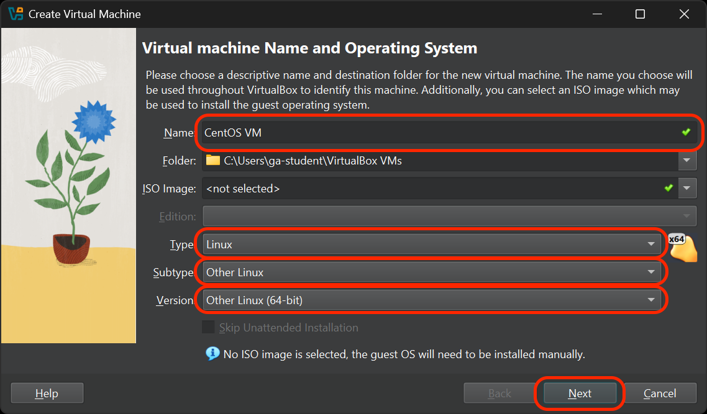
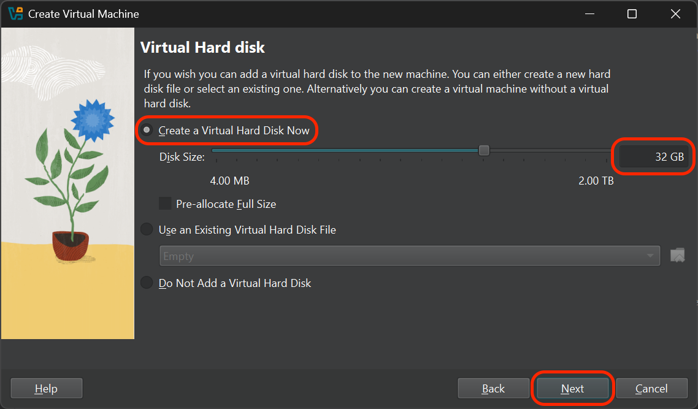
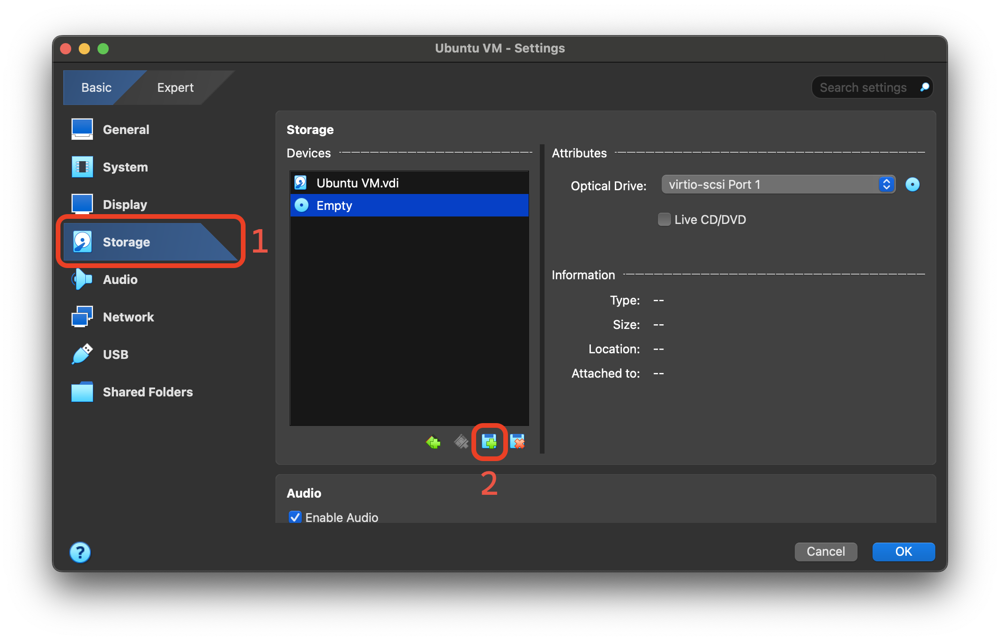
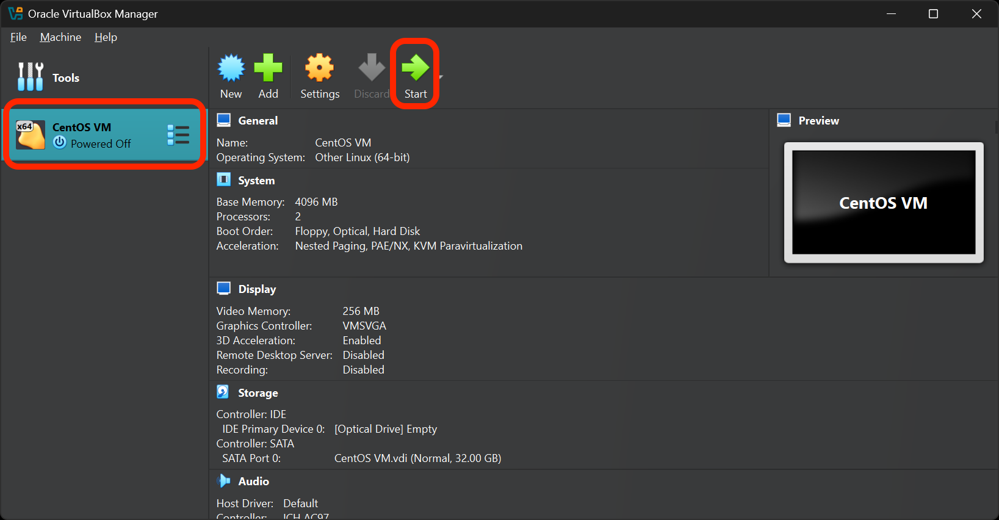
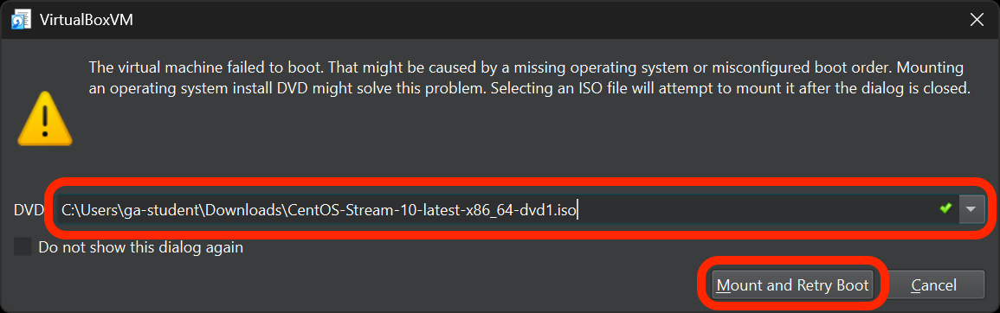

<h1>
  <span class="headline">Setup Your Own VM Lab</span>
  <span class="subhead">Create an CentOS VM</span>
</h1>

**Learning objective:** By the end of this lesson, students will be able to create a new VM and install the CentOS operating system on it.

## Creating a virtual machine (VM) running CentOS

Most of the images in this guide demonstrate this process utilizing Windows, but the steps should generally be the same regardless of your OS. When there are differences, these are called out or demonstrated below.

> 🧠 As part of this exercise, you may need to do some troubleshooting and research to complete some of the steps. This is a valuable skill to develop now, as you'll need it throughout your career. If something is not working, try to deduce what the problem is and use your problem-solving skills and the internet to find a solution.

### Download the CentOS ISO

You'll need a copy of the CentOS Stream9 ISO file to install CentOS on your VM. An ISO file is a disk image containing all the files that would be on a physical disk. It's the most common format used to install operating systems.

> 🧠 ISO files were far more prevalent when software was distributed primarily using physical media such as CDs or DVDs. You won't encounter them as often when installing regular applications anymore, but they used to be one of the primary distribution formats for all software.

This process is slightly different depending on your OS and hardware. Follow the instructions for your OS below.

#### Non-Apple Silicon Macs, Windows, and Ubuntu

Use [this link](https://mirrors.centos.org/mirrorlist?path=/9-stream/BaseOS/x86_64/iso/CentOS-Stream-9-latest-x86_64-dvd1.iso) to download the Fedora Workstation 41 file.

#### Apple Silicon Macs

Use [this link](https://mirrors.centos.org/mirrorlist?path=/9-stream/BaseOS/aarch64/iso/CentOS-Stream-9-latest-aarch64-dvd1.iso) to download the Fedora Workstation 41 file for ARM computers.

## Create a new VM in VirtualBox

1. Open VirtualBox and select the **New** button to create a new VM.

   

2. You'll be taken to the **Virtual machine Name and Operating System** screen.

   1. Give it an appropriate name, such as **CentOS VM**.
   2. Choose **Linux** as the type unless you're using an Apple Silicon Mac - then choose the **Other** option.
   3. Choose **Other Linux** as the subtype unless you're using an Apple Silicon Mac - then you won't chose a subtype option.
   4. Select the **Other Linux (64-bit)** version unless you're using an Apple Silicon Mac - then choose the **Other/Unknown (ARM 64-bit)** version.
   5. Confirm your selections, then select **Next**.

   

3. You'll arrive at the **Hardware** screen.

   1. Allocate at least 2048 MB (2 GB) of RAM to your VM. 4096 MB (4 GB) of RAM or more is recommended for better performance.
   2. Allocate at least 1 CPU. 2 or more CPUs are recommended for better performance.
   3. Select **Next**.

   

4. On the **Virtual Hard disk** screen:

   1. Choose the **Create a Virtual Hard Disk now** option.
   2. Specify the size of your virtual hard disk. For a CentOS VM, it's typically recommended to allocate at least 32 GB, but you can complete this exercise by reserving as little as 12 GB.
   3. Select **Next**.

   

5. You'll be taken to a **Summary** screen. Select the **Finish** button.

6. **On macOS only**: This is where we'll use the ISO file you downloaded earlier (if it's not done downloading yet, let it finish first). Select your VM in the VirtualBox Manager, and navigate to the VM's **Settings**.

   On the **Storage** tab, select the **Add Attachment** button and then select the **Optical Disk** option. In the new window, select the **Add** icon at the top of the window and choose the CentOS ISO you downloaded earlier. Finally, select the **Choose** button.

   

7. Your new VM should now appear in the VirtualBox Manager. Select it, and then select the **Start** button.

   

   > ⚠️ On macOS, you may be prompted to allow VirtualBox to access your keystrokes. You'll need to allow this and then restart VirtualBox for the changes to take effect. You'll then be prompted to allow VirtualBox to control your computer. Allow this as well, and then restart VirtualBox again.

8. **Windows and Linux only**: VirtualBox will inform you that the VM failed to boot and ask you to mount an operating system install DVD. This is where we'll use the ISO file you downloaded earlier (if it's not done downloading yet, let it finish first). Choose the file path for the ISO file, then select the **Mount and Retry Boot** button. VirtualBox will restart your VM.

   

9. The CentOS installer should start automatically after you select the **Install CentOS** option. Follow the on-screen instructions to complete the installation.

### Reflection - VM installation

**Answer these questions in your <code class="filepath">create-a-vm.md</code> file in VS Code:**

- What OS is your VM running?
- What challenges did you face while creating your VM? How did you overcome them?
- How much RAM and hard disk space did you allocate to your VM? Why did you choose these amounts?
- What do you think would happen if you allocated too much RAM to your VM?

## Configuring your CentOS VM

1. Start your CentOS VM and wait for it to boot up.

   We're going to install the VirtualBox Guest Additions, which are tools that improve the performance and usability of your VM. To do that, we need to install a few packages from the CentOS repositories first.

2. Once you're at the CentOS desktop, open CentOS's **Terminal** application.

3. Run this command in the terminal to update your package list:

   ```bash
   sudo apt update
   ```

   > ⚠️ This command will prompt you for your password. Type it in and press **Enter**. You won't see any characters appear as you type your password, but it's still being entered.

4. Run the following command in the terminal to install the required packages. You may be asked to provide your password again. Do so.

   ```bash
   sudo apt install bzip2 build-essential gcc make perl dkms
   ```

5. That installation will take a moment. Once it's complete, reboot the virtual machine. You can use the handy `reboot` command to do this if you'd like:

   ```bash
   reboot
   ```

6. Once you're at the CentOS desktop again, open the **Devices** option in the VirtualBox menu bar. Next, select the then **Insert Guest Additions CD image** option. This will mount a virtual CD containing the VirtualBox Guest Additions, which are tools that improve the performance and usability of your VM.

7. Open the Files app in your VM and navigate to the CD drive. Select the **Run Software** button towards the top of the window to run the software.

8. Follow the prompts to install the Guest Additions. The installation will take a moment and produce an output that looks similar to the following:

   ```plaintext
   Verifying archive integrity...  100%   MD5 checksums are OK. All good.
   Uncompressing VirtualBox 7.1.6 Guest Additions for Linux  100%  
   VirtualBox Guest Additions installer
   Removing installed version 7.1.6 of VirtualBox Guest Additions...
   update-initramfs: Generating /boot/initrd.img-6.11.0-17-generic
   VirtualBox Guest Additions: Starting.
   VirtualBox Guest Additions: Setting up modules
   VirtualBox Guest Additions: Building the VirtualBox Guest Additions kernel
   modules. This may take a while.
   VirtualBox Guest Additions: To build modules for other installed kernels, run
   VirtualBox Guest Additions:   /sbin/rcvboxadd quicksetup <version>
   VirtualBox Guest Additions: or
   VirtualBox Guest Additions:   /sbin/rcvboxadd quicksetup all
   VirtualBox Guest Additions: Building the modules for kernel 6.11.0-17-generic.
   update-initramfs: Generating /boot/initrd.img-6.11.0-17-generic
   Press Return to close this window...
   ```

   Shut down your VM.

9. After you've shut down your VM, select your VM in the VirtualBox Manager, and navigate to the VM's **Settings**.

10. Once in the **Settings** menu, you will need to enable 3D acceleration and allocate the maximum amount of video memory. You may need to do some research on the internet to discover how to do this.

11. Start your VM again. You should notice improved graphics performance.

12. After restarting, open the **Devices** option in the VirtualBox menu bar again. Then select **Shared Clipboard** and choose the **Bidirectional** option. This will allow you to copy and paste between your host and your VM.

## Reflection - Configuring your CentOS VM

**Answer these questions in your <code class="filepath">create-a-vm.md</code> file in VS Code:**

- What settings did you change and why?
- How did your VM perform before and after changing the settings?
- What other settings do you think could be important for optimizing a VM's performance?
