<h1>
  Setup Your Own VM Lab
  Create a Windows VM
</h1>

**Learning objective:** By the end of this lesson, students will be able to create a new VM and install an operating system on it.

## Important note for those using a Mac with an Apple Silicon chip

Macs with Apple Silicon chips cannot run a Windows 10 VM with VirtualBox. Exit this exercise and install a VM running another operating system instead.

## Creating a virtual machine (VM) running Windows 10

Most of the images in this guide demonstrate this process utilizing Windows, but the steps should generally be the same regardless of your OS. When there are differences, these are called out or demonstrated below.

> 🧠 As part of this exercise, you may need to do some troubleshooting and research to complete some of the steps. This is a valuable skill to develop now, as you'll need it throughout your career. If something is not working, try to deduce what the problem is and use your problem-solving skills and the internet to find a solution.

### Download the Windows 10 ISO

You'll need a copy of the Windows 10 ISO file to install Windows on your VM. An ISO file is a disk image containing all the files that would be on a physical disk. It's the most common format used to install operating systems.

> 🧠 ISO files were far more prevalent when software was distributed primarily using physical media such as CDs or DVDs. You won't encounter them as often when installing regular applications anymore, but they used to be one of the primary distribution formats for all software.

This process is slightly different if you're using Windows than if you're using macOS or Ubuntu. Follow the instructions for your OS below.

#### Windows

1. Open your web browser and navigate to the [Windows 10 download page](https://www.microsoft.com/en-us/software-download/windows10).

2. Under the **Create Windows 10 installation media** heading, select the **Download Now** button, as outlined in red below.

   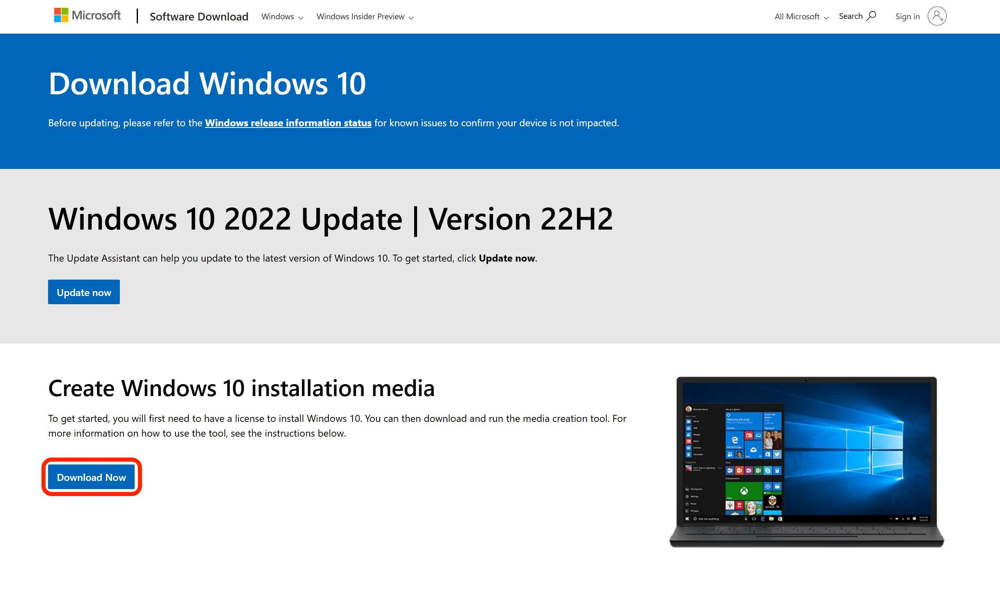

3. A download will begin. When it is complete, open the downloaded <code class="filepath">.exe</code> file.

4. Accept the license terms.

5. On the **What do you want to do now** screen, select the **Create installation media (USB flash drive, DVD, or ISO file) for another PC** option and select the **Next** button.

   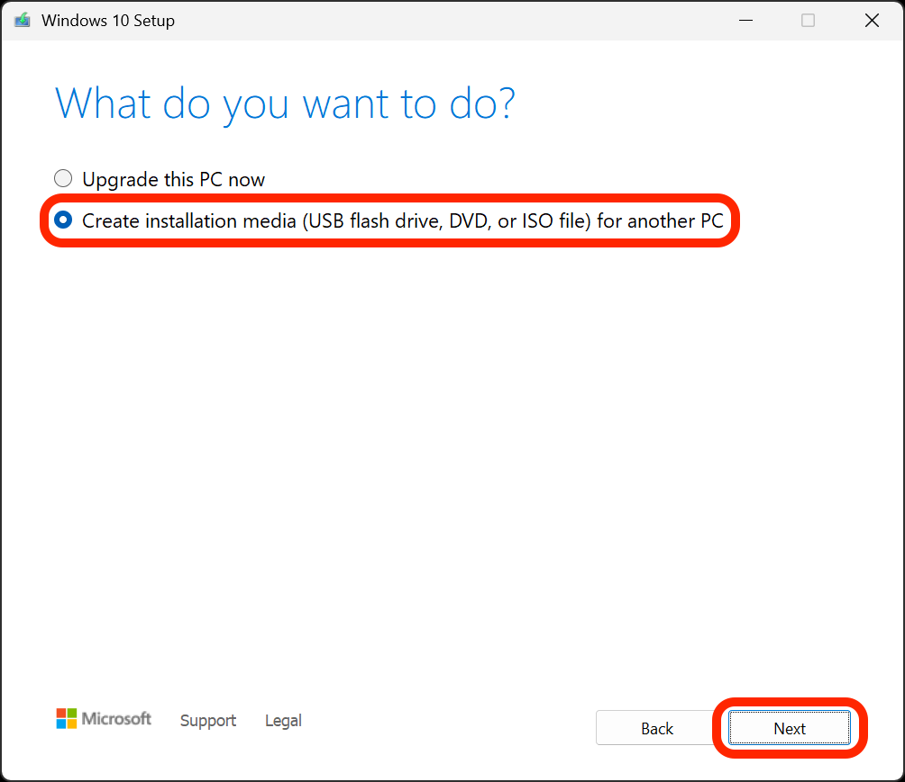

6. On the **Select language, architecture, and edition** screen, select the **Use the recommended options for this PC** checkbox, then select the **Next** button.

   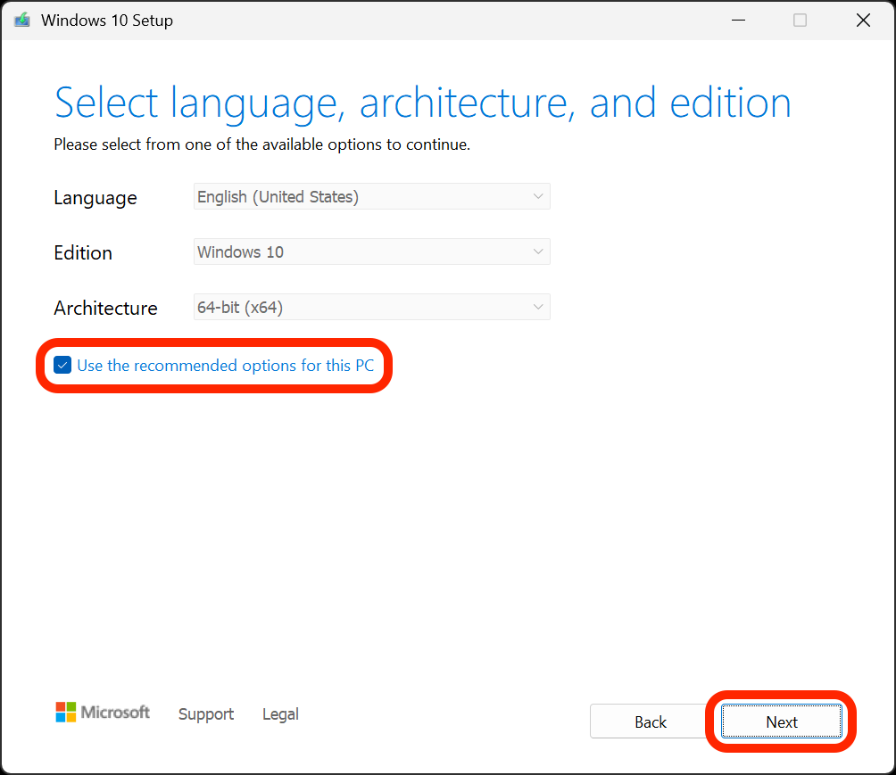

7. On the **Choose which media to use** screen, select the **ISO file** option and then the **Next** button.

   > 😎 Don't worry; despite what this page says, you won't need to burn the ISO file to a DVD later.

   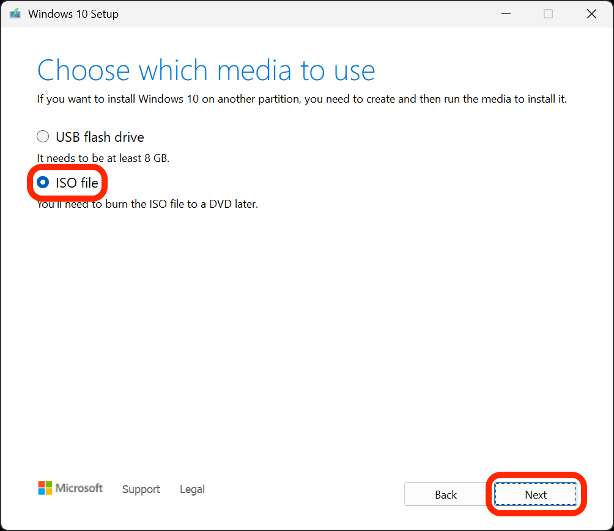

8. Select a location to save the ISO file and select the **Save** button.

   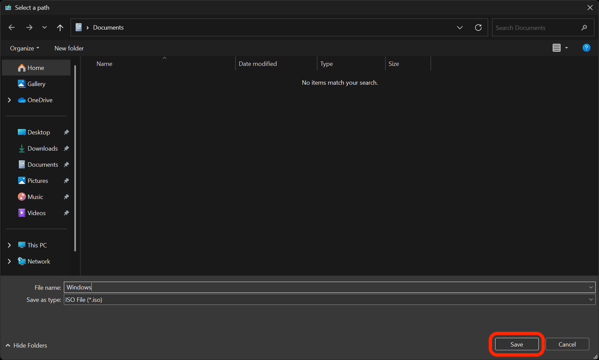

9. The download will begin. While it's running, you can continue to the **Use the Windows 10 ISO to create a new VM in VirutalBox** section below. When it is complete, select the **Finish** button.

#### macOS and Ubuntu

> 🚨 **Final warning!** If you are using a Mac with an Apple Silicon chip, you cannot create a Windows 10 VM using VirtualBox. Create a VM running CentOS instead.

1. Open your web browser and navigate to the [Windows 10 download page](https://www.microsoft.com/en-us/software-download/windows10).

2. Under the **Select edition** heading, select the **Windows 10 (multi-edition ISO)** option from the dropdown menu and then select the **Confirm** button - both of which are outlined in red below. You may have to wait a moment before the next step appears.

   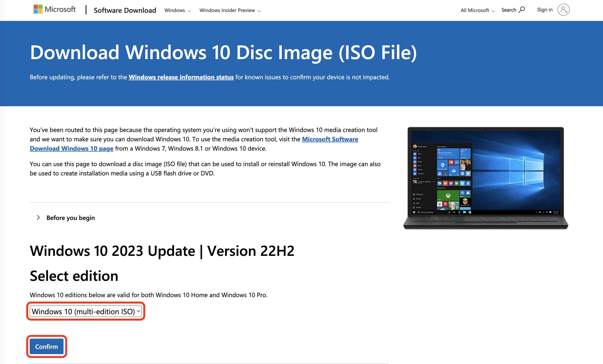

3. After selecting the **Confirm** button in the previous step, the **Select product language** heading should appear, but this may take a moment. When it does appear, select the language you want to use to install the OS from the dropdown menu (**English (United States)** is shown in the screenshot below). Then select the **Confirm** button outlined in red below.

   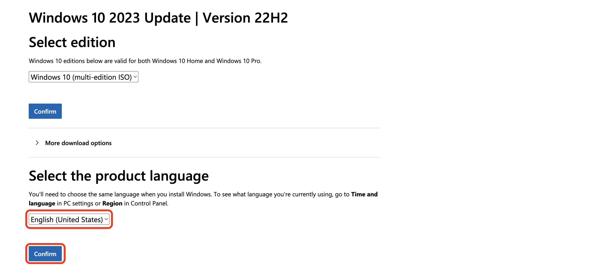

4. You'll be taken to a new page with two buttons. Select the **64-bit Download** button outlined in red below. While it's running, you can continue to the **Use the Windows 10 ISO to create a new VM in VirutalBox** section below.

   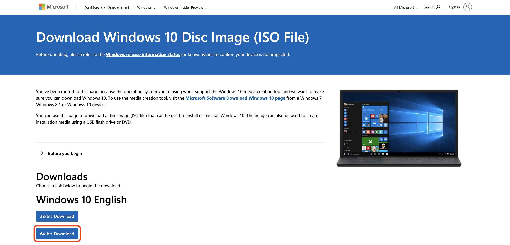

## Create a new VM in VirtualBox

1. Open VirtualBox and select the **New** button to create a new VM.

   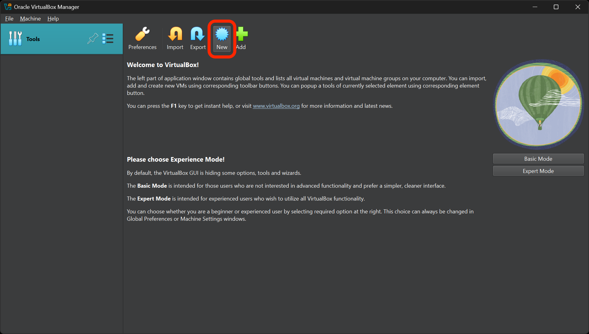

2. You'll be taken to the **Virtual machine Name and Operating System** screen.

   1. Give it an appropriate name, such as **Windows VM**.
   2. Choose **Microsoft Windows** as the type.
   3. Select the **Windows 10 (64-bit)** version.
   4. Confirm your selections, then select **Next**.

   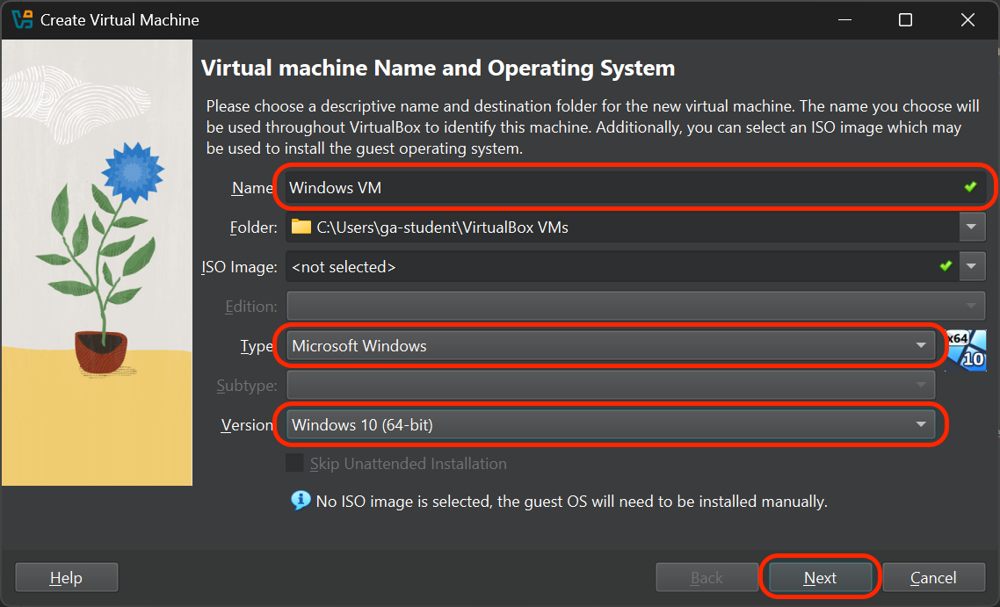

3. You'll arrive at the **Hardware** screen.

   1. Allocate at least 2048 MB (2 GB) of RAM to your VM. 4096 MB (4 GB) of RAM or more is recommended for better performance.
   2. Allocate at least 1 CPU. 2 or more CPUs are recommended for better performance.
   3. Select **Next**.

   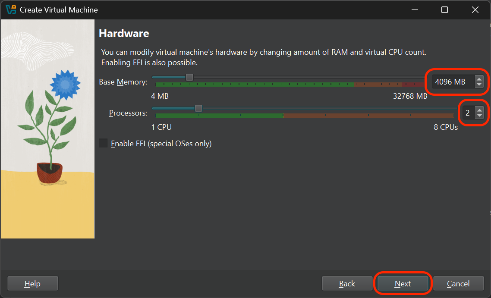

4. On the **Virtual Hard disk** screen:

   1. Choose the **Create a Virtual Hard Disk now** option.
   2. Specify the size of your virtual hard disk. For a Windows VM, it's typically recommended to allocate at least 64 GB, but you can complete this exercise by reserving as little as 24 GB.
   3. Select **Next**.

   

5. You'll be taken to a **Summary** screen. Select the **Finish** button.

6. Your new VM should now appear in the VirtualBox Manager. Select it, and then select the **Start** button.

   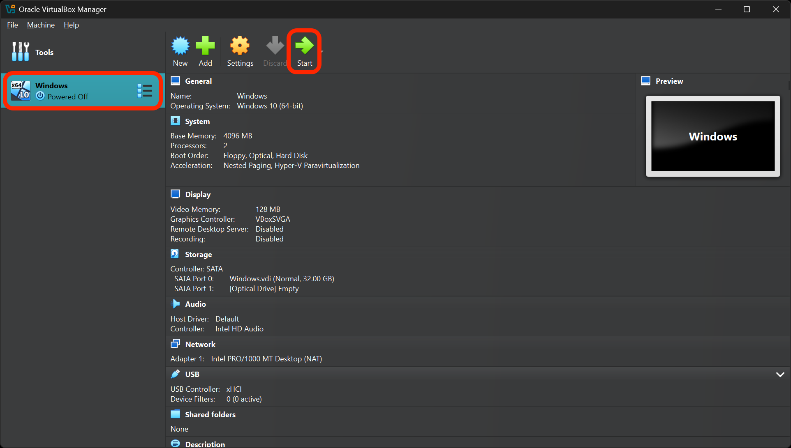

   > ⚠️ On macOS, you may be prompted to allow VirtualBox to access your keystrokes. You'll need to allow this and then restart VirtualBox for the changes to take effect. You'll then be prompted to allow VirtualBox to control your computer. Allow this as well, and then restart VirtualBox again.

7. VirtualBox will inform you that the VM failed to boot and ask you to mount an operating system install DVD. This is where we'll use the ISO file you downloaded earlier (if it's not done downloading yet, let it finish first). Choose the file path for the ISO file, then select the **Mount and Retry Boot** button.

   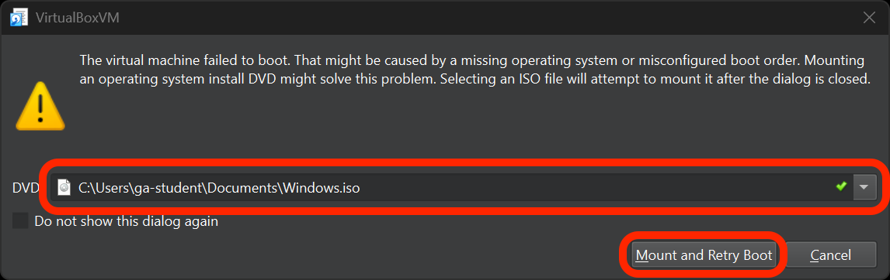

8. VirtualBox will restart your VM. The Windows installer should start automatically. Follow the on-screen instructions to complete the installation; note the following as you go through the installation process.

   > ⚠️ If you get a prompt asking for a product key, you can select the **I don't have a product key** option (unless you have an extra product key handy and would like to use it). You can use Windows without a license for a limited 30-day trial period. If you plan to use it for a longer period, you'll need to purchase a license for the version of Windows you installed.
   >
   > Speaking of which, you'll be prompted to choose the operating system you want to install. Select either the Windows 10 Home or Windows 10 Pro option. Do not select an option that ends with **N** in the name.
   >
   > When prompted which type of installation you want, select the **Custom: Install Windows only (advanced)** option, then install the OS on the **Drive 0 Unallocated Space** option.

### Reflection - VM installation

**Answer these questions in your <code class="filepath">create-a-vm.md</code> file in VS Code:**

- What OS is your VM running?
- What challenges did you face while creating your VM? How did you overcome them?
- How much RAM and hard disk space did you allocate to your VM? Why did you choose these amounts?
- What do you think would happen if you allocated too much RAM to your VM?

## Configuring your Windows VM

1. Start your Windows VM and wait for it to boot up.

2. Once you're at the Windows desktop, open the **Devices** option in the VirtualBox menu bar. Next, select the then **Insert Guest Additions CD image** option. This will mount a virtual CD containing the VirtualBox Guest Additions, which are tools that improve the performance and usability of your VM.

   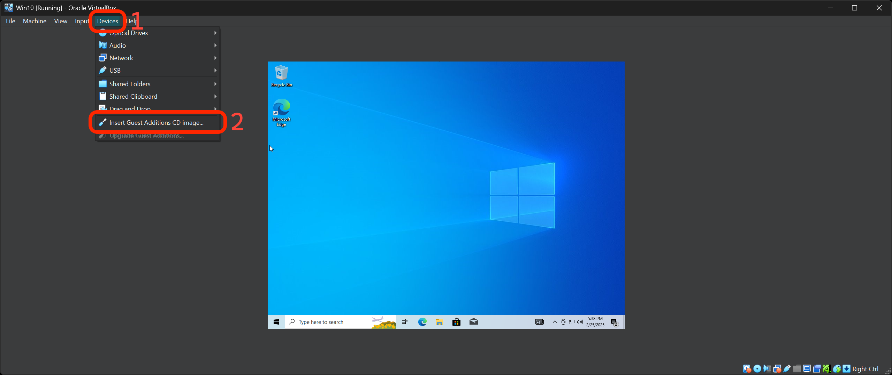

3. Open File Explorer in your VM and navigate to the CD drive. Double-click on the **VBoxWindowsAdditions** executable to start the installation.

4. Follow the prompts to install the Guest Additions. When the installation is complete, you'll be prompted to reboot the VM, but you should shut it down instead.

5. After you've shut down your VM, select your VM in the VirtualBox Manager, and navigate to the VM's **Settings**.

6. Once in the **Settings** menu, you will need to enable 3D acceleration and allocate the maximum amount of video memory. You may need to do some research on the internet to discover how to do this.

7. Start your VM again. You should notice improved graphics performance.

8. After restarting, open the **Devices** option in the VirtualBox menu bar again. Then select **Shared Clipboard** and choose the **Bidirectional** option. This will allow you to copy and paste between your host and your VM.

## Reflection - Configuring your Windows VM

**Answer these questions in your <code class="filepath">create-a-vm.md</code> file in VS Code:**

- What settings did you change and why?
- How did your VM perform before and after changing the settings?
- What other settings do you think could be important for optimizing a VM's performance?
