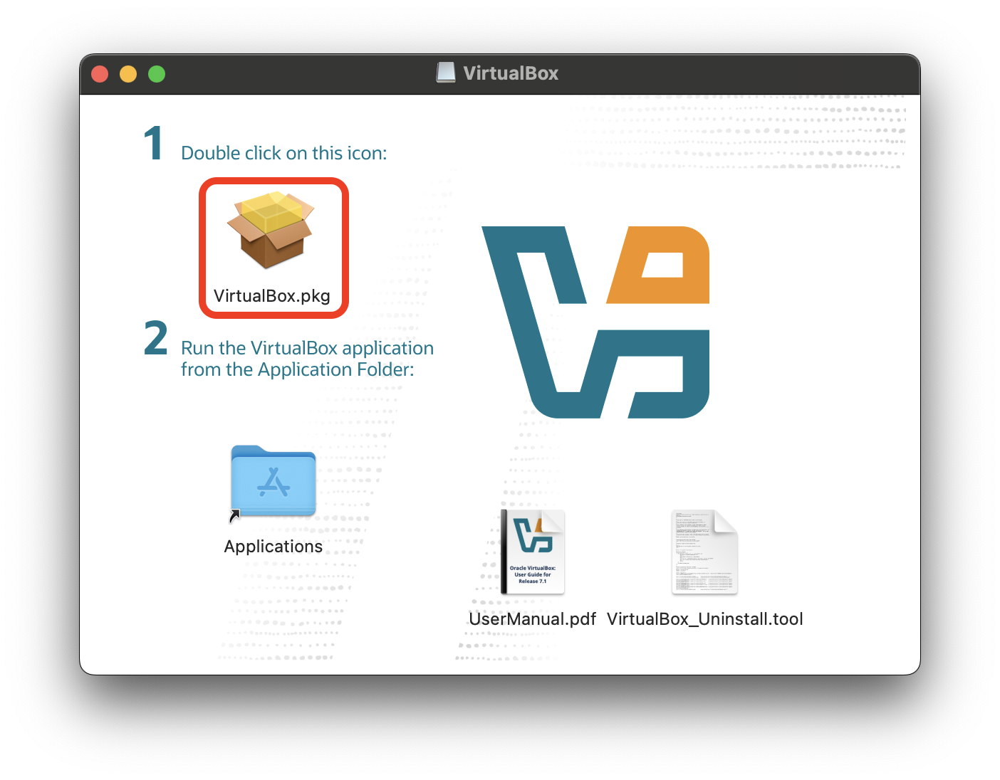
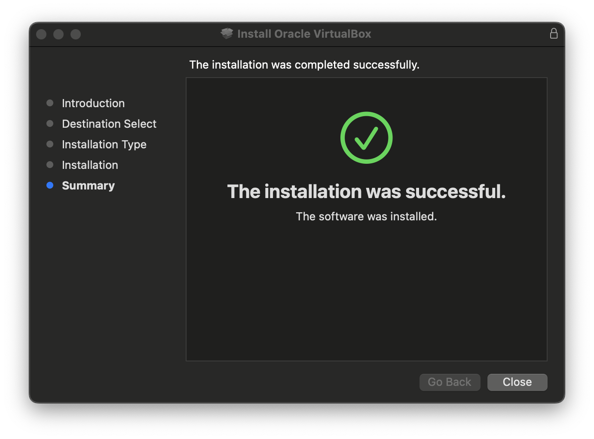

<h1>
  Setup Your Own VM Lab
  Install VirtualBox on macOS
</h1>

**Learning objective:** By the end of this lesson, students will be able to install VirtualBox on a device running macOS.

## Download VirtualBox

You'll use a different version of VirtualBox depending on whether your Mac has an Intel or Apple Silicon chip. You must download the appropriate installer for your machine.

### Apple Silicon Chip

Download Oracle VirtualBox 7.1.6 for macOS using [this link](https://download.virtualbox.org/virtualbox/7.1.6/VirtualBox-7.1.6-167084-macOSArm64.dmg).

### Intel Chip

Download Oracle VirtualBox 7.1.6 for macOS using [this link](https://download.virtualbox.org/virtualbox/7.1.6/VirtualBox-7.1.6-167084-OSX.dmg).

## Install VirtualBox

1. Open the downloaded <code class="filepath">.dmg</code> file.

2. Double-click the <code class="filepath">VirtualBox.pkg</code> icon.

   

3. You will be given many prompts on features to install and choices to make while installing VirtualBox. Accept all the default options.

4. When the installation is complete, you will see a message that says **The installation was successful.** Select the **Close** button.

   

5. You can find the VirtualBox application in your <code class="filepath">Applications</code> directory. You should also be able to launch using Spotlight (<kbd>⌘ Command</kbd> + <kbd>Space</kbd>).

## Troubleshooting

If you encounter an error during installation, attempt to resolve it by following the instructions in the error message. Searching for the error message online may also help you find a solution.
