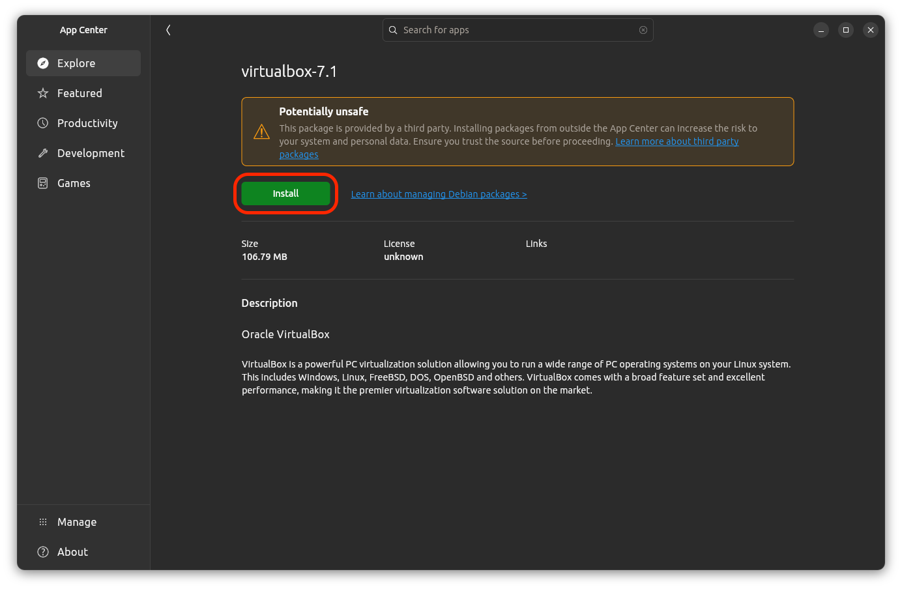
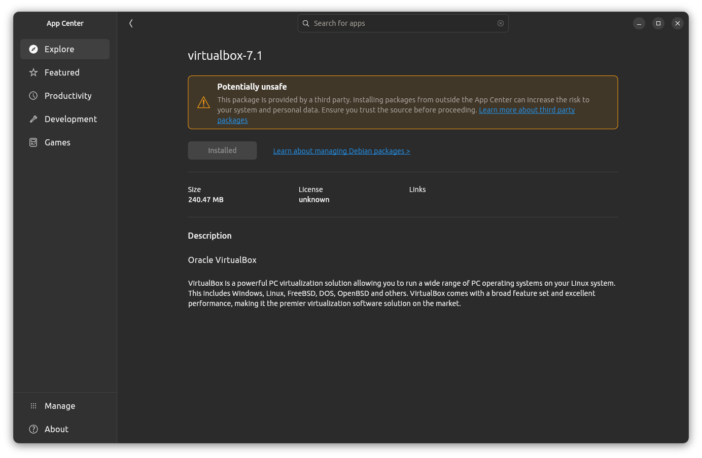

<h1>
  Setup Your Own VM Lab
  Install VirtualBox on Ubuntu
</h1>

**Learning objective:** By the end of this lesson, students will be able to install VirtualBox on a device running Ubuntu 24.04 (Noble).

## Download VirtualBox

Download Oracle VirtualBox 7.1.6 for Ubuntu 24.04 using [this link](https://download.virtualbox.org/virtualbox/7.1.6/virtualbox-7.1_7.1.6-167084~Ubuntu~noble_amd64.deb).

## Install VirtualBox

1. Open the downloaded <code class="filepath">.deb</code> file.

2. The **App Center** app will open. Select the Install button.

   

3. You will warned that the package is provided by a third party and may not be safe. Select the **Install** button, and provide your password.

4. When the installation is complete, the text in the **Install** button you selected earlier will change to **Installed**, indicating that the installation is complete. You can now close the **App Center** app.

   

5. You should now be able to launch the VirtualBox application using System Search.

## Troubleshooting

If you encounter an error during installation, attempt to resolve it by following the instructions in the error message. Searching for the error message online may also help you find a solution.
