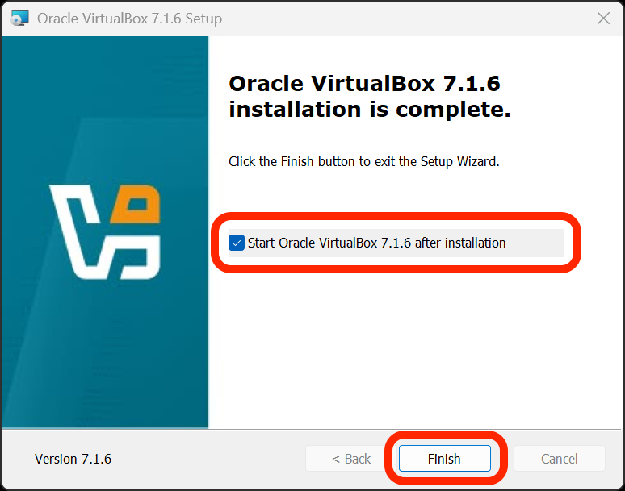

<h1>
  Setup Your Own VM Lab
  Install VirtualBox on Windows
</h1>

**Learning objective:** By the end of this lesson, students will be able to install VirtualBox on a device running Windows 11.

## Download VirtualBox

Download Oracle VirtualBox 7.1.6 for Ubuntu 24.04 using [this link](https://download.virtualbox.org/virtualbox/7.1.6/VirtualBox-7.1.6-167084-Win.exe).

## Install VirtualBox

1. Open the downloaded <code class="filepath">.exe</code> file.

2. Allow the app to make changes to your device.

3. You may be prompted to install the **Microsoft Visual C++ 2019 Redistributable Package** before installing VirtualBox. If you are not, skip to the next step. If you are, select the **OK** button. You'll get a prompt that indicates that a fatal error occurred. Select the **Finish** button to close the window. Another prompt will appear telling you the installation failed. Again, select the **OK** button to close the window.

   Download the **Microsoft Visual C++ 2019 Redistributable Package** using [this link](https://aka.ms/vs/17/release/vc_redist.x64.exe). Open the downloaded <code class="filepath">.exe</code> file. Allow the app to make changes to your device. Complete the installation by accepting any default options. When the installation is complete, select the **Close** button.

   Resume the VirtualBox installation by opening the <code class="filepath">.exe</code> file again. Allow the app to make changes to your device and continue to the next step.

4. You will be given many prompts on features to install and choices to make while installing VirtualBox. Accept all the default options. You may temporarily lose internet access while the installation is in progress.

5. When the installation is complete, ensure the **Start Oracle VirtualBox 7.1.6 after installation** checkbox is ticked, and select the **Finish** button.

   

6. In the future, you also launch the VirtualBox application by searching for it in the Start menu.

## Troubleshooting

If you encounter an error during installation, attempt to resolve it by following the instructions in the error message. Searching for the error message online may also help you find a solution.
